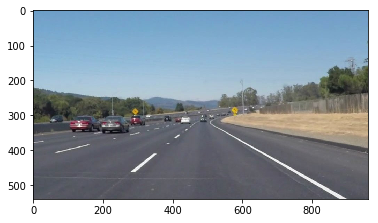
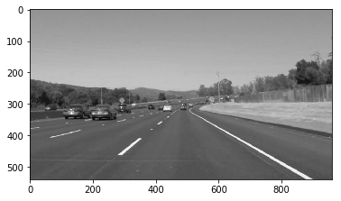
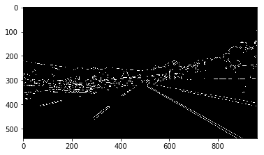
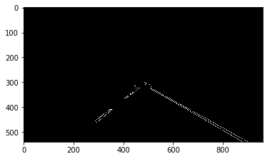
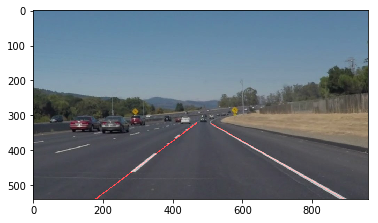
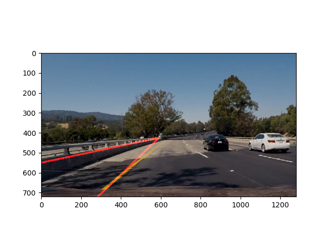

# **Finding Lane Lines on the Road** 

The aim of this project is to create a pipeline that finds the lane lines on the
road.

### 1. Description of the pipeline

The pipeline consists of _five_ main steps, outlined below:

1. Convert the Image to Grayscale
2. Apply Gaussian blur
3. Apply Canny Edge Detection
4. Apply a Region Mask
5. Apply the Hough Line transform
6. Combine the detected lines with original image

#### 1. Convert the Image to Grayscale

An image with lane markings is first given. Here's an example:



The image first needs to be converted to grayscale. This is because
`cv2.Canny()` expects a _single-channel_ 8-bit image to be supplied. The result
looks like this:



#### 2. Apply Gaussian Blur

In order to reduce noise (and therefore reduce the detection of unwanted edges),
before applying Canny edge-detection, Gaussian blurring is applied: 


#### 3. Apply Canny Edge Detection

With the image pre-processed, the edges can now be detected:



#### 4. Apply a Region Mask

Since the objective is to detect lane lines, before applying Hough, a region
mask is applied to make sure only the region of the lane that we're interested
in is considered:



The current implementation uses a triangle that's 45% the height of the image
and as wide as the width of the image.

#### 5. Apply the Hough Line Transform

The Hough line transform is used to detect lines in the image. More precisely,
the _probabilistic_ Hough transform is used. 

The good thing (aside from efficiency) about using `cv2.HoughLinesP()` instead 
of `cv2.HoughLines()` is that the former outputs lines represented by pairs of 
`(x,y)`  coordinates while the later lines are represented in ρ and θ. 

##### Modification of `draw_lines()`

The Hough transform outputs detected lines. We need to figure out where the
lines are part of the lane that we are interested in. The algorithm is as
follows:

1. For each line, compute the slope. 

2. Ignore the line if it has too low a slope, because that means that it's 
horizontal or close to horizontal. Otherwise, group the lines into belonging to
the left or right lane, depending on whether the slope is positive or negative,
respectively.

3. Given both groups of lines, we can compute the best-fit line using
   `np.polyfit()`.
   

#### 6. Combine the detected lines with original image

Finally, the output image from the Hough transform is superimposed on the
original image:



### 2. Shortcomings of the current implementation

The most obvious shortcoming is that the current implementation doesn't handle
road bends very well. This is because only lines of the form `y = mx + c` are
considered.

Another is that is not known how the implementation fares in less than ideal
weather and lighting conditions. For example, streaks of rain might confuse the
pipeline, which night-time might obscure the lane markings.

The pipeline also has slight trouble when the lane markings are faded or too 
ahead.

### 3. Possible Improvements

Running the pipeline with more data and making tweaks would defintely improve
the pipeline's performance.

The region mask can also be potentially tweaked. While the current
implementation using a triangle, using a region such as a trapezium might yield
better results.

The biggest change in results came from tweaking the parameters of
`cv2.HoughLinesP()`, in particular the `threshold`, `min_line_len`, and
`max_line_gap`. However, finding a set of values that works well is challenging.

In addition to using the slope, we can also exploit the _color_ of the line to
detemine if it is indeed a lane marking or not.

### 4. Challenge

In order to tackle the challenge, I first extracted frames from the challenge
video, `challenge.mp4`:"

```
challenge_output = 'test_videos_output/challenge.mp4'
clip = VideoFileClip("test_videos/challenge.mp4")

for t in range(0, 10):
    img_path = "test_images/challenge" + str(t) + ".jpg"
    clip.save_frame(img_path, t)
```

Images like this quickly exposed problems in my implementation:



I found that tweaking the `threshold`, `max_line_gap` and `min_line_len` yielded
the biggest improvements.
